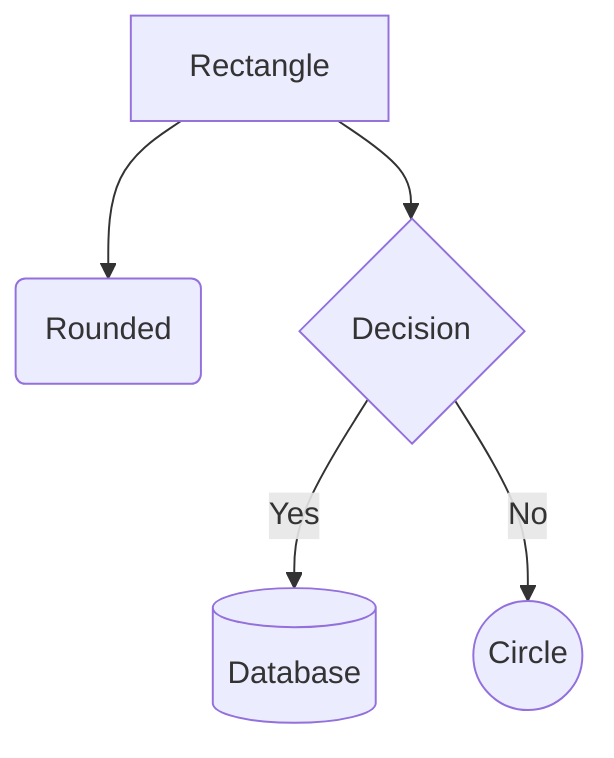
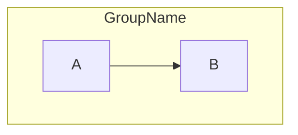
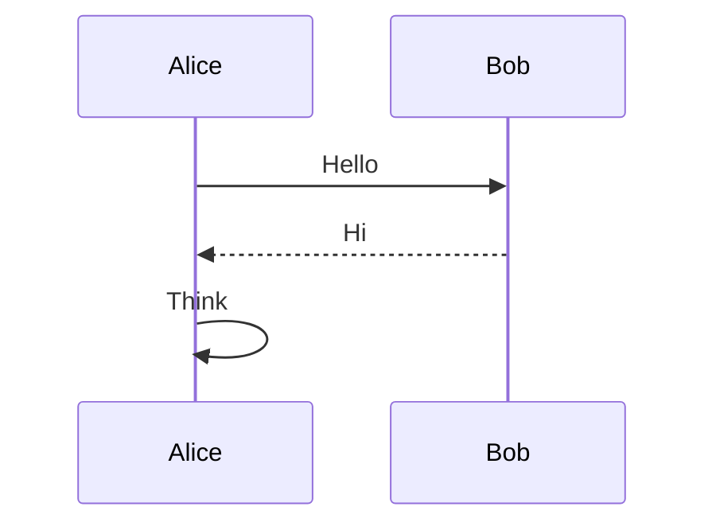
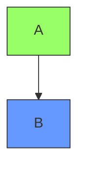

# Mermaid Diagram Skill

Create diagrams for blog posts: understand the content, pick the right diagram type, iterate with `mermaid-ascii` for terminal preview, then render final SVG with `mmdc`. Fall back to manual ASCII + Gemini image generation when Mermaid can't produce a good enough result.

## Invocation

```
/mermaid-diagram [description, sketch, or reference image]
```

## Expected Input

The user will typically provide one or more of:

- **A blog post path** — read it to understand the concepts that need diagramming
- **A description** — what the diagram should convey
- **A reference image** — an existing diagram to recreate or adapt (the user places it in `drafts/img/`)
- **An ASCII sketch** — a rough layout to formalize

## Workflow

### 1. Understand the Content

If working in the context of a blog post, **read the post first**. Understand:

- What concept or process needs a visual explanation
- What entities/steps/relationships are involved
- What level of detail serves the reader (not everything needs to be in the diagram)

### 2. Choose Diagram Type

Pick the type that best fits the content:

| Type | Keyword | Best for |
|------|---------|----------|
| Flowchart | `flowchart TD` / `flowchart LR` | Processes, trees, data flow |
| Sequence | `sequenceDiagram` | Interactions between actors over time |
| Class | `classDiagram` | Object relationships, system structure |
| State | `stateDiagram-v2` | State machines, lifecycles |
| ER | `erDiagram` | Database schemas, entity relationships |
| Mindmap | `mindmap` | Hierarchical brainstorming |

Flowchart directions: `TD` (top-down), `LR` (left-right), `RL`, `BT`.

Present the choice to the user before proceeding.

### 3. Look Up Syntax

Before drafting, **always** WebFetch the relevant syntax docs from the Mermaid repo:

```
https://raw.githubusercontent.com/mermaid-js/mermaid/develop/packages/mermaid/src/docs/syntax/<type>.md
```

Where `<type>` is one of: `flowchart`, `sequenceDiagram`, `classDiagram`, `stateDiagram`, `entityRelationshipDiagram`, `mindmap`, `timeline`, `gantt`, `pie`, `quadrantChart`, `block`, `architecture`, `sankey`, `xyChart`.

### 4. Draft the `.mmd` File

Write the source file to `static/mmdc/<diagram-name>.mmd`.

### 5. Preview with mermaid-ascii

```bash
mermaid-ascii -f static/mmdc/<diagram-name>.mmd
```

Use this to verify structure and connections. Iterate until the layout is correct.

**mermaid-ascii limitations:**

- No subgraph support
- No special node shapes (only rectangles)
- `[label]` bracket syntax in node names can break multi-level TD layouts — use descriptive bare node IDs when previewing
- Multiline labels (`<br/>`) not supported — use single-line labels for preview

**Useful flags:**

- `-x 8` — increase horizontal spacing
- `-y 8` — increase vertical spacing
- `-p 3` — increase box padding
- `--ascii` — pure ASCII output (no Unicode box-drawing)

### 6. Render Final SVG

Preview first to `drafts/img/`, then promote to `static/img/` when approved:

```bash
# Preview
mmdc -i static/mmdc/<diagram-name>.mmd -o drafts/img/<diagram-name>.svg -b white

# After user approval, copy to final location
cp drafts/img/<diagram-name>.svg static/img/<diagram-name>.svg
```

### 7. Embed in Post

```markdown
.svg" alt="Description of diagram">
```

## Fallback: Manual ASCII + Gemini Image Generation

If Mermaid can't produce a good enough layout (e.g., complex trees, precise spatial control needed):

1. **Draft the diagram manually as ASCII art** using Unicode box-drawing characters (`┌─┐│└─┘` for boxes, `─│` for lines, `►▼◄▲` for arrows). Keep labels concise. Align carefully.

2. **Generate a polished image** using the `gemini-image.py` script in this skill directory:

```bash
.claude/skills/mermaid-diagram/gemini-image.py drafts/img/<name>.png "Description of the diagram to generate"
```

Use `-m pro` for higher quality (Nano Banana Pro), default is `-m flash` (free tier):

```bash
.claude/skills/mermaid-diagram/gemini-image.py -m pro drafts/img/<name>.png "Description..."
```

Include the ASCII art in the prompt for spatial guidance. After user approval, copy to `static/img/`.

3. The user may also choose to use the ASCII art directly in the post (inside a code block), or feed it to an external image generator themselves.

## Tools

### mermaid-ascii

Terminal preview of Mermaid diagrams as ASCII art. Supports flowcharts and sequence diagrams.

- **Repo:** https://github.com/AlexanderGrooff/mermaid-ascii
- **Installed at:** `~/.local/bin/mermaid-ascii`
- **Update script:** `~/.local/bin/update-mermaid-ascii`

### gemini-image.py

Python script (in this skill directory) that generates images from text prompts via the Gemini API. Uses `uv run --script` for dependency management — no install needed.

- **Location:** `.claude/skills/mermaid-diagram/gemini-image.py`
- **Requires:** `GEMINI_API_KEY` environment variable
- **Models:** `flash` (default, free tier) or `pro` (Nano Banana Pro, paid)
- **Usage:** `gemini-image.py [-m flash|pro] <output-path> <prompt>`

### beautiful-mermaid (not installed)

Node/TypeScript library for rendering Mermaid as SVG or ASCII with theming. Supports more diagram types than mermaid-ascii (flowcharts, sequence, state, class, ER). Could replace `mmdc` for SVG rendering.

- **Repo:** https://github.com/lukilabs/beautiful-mermaid
- **Install:** `npm install beautiful-mermaid`

## Quick Syntax Reference

### Flowchart Basics



**Node shapes:** `[rect]`, `(rounded)`, `{diamond}`, `[(database)]`, `((circle))`, `[[subroutine]]`, `>flag]`

**Edges:** `-->` solid arrow, `-.->` dotted, `==>` thick, `---` no arrow, `-->|label|` with label

**Subgraphs:**



### Sequence Diagram Basics



**Arrows:** `->>` solid, `-->>` dotted, `-x` cross, `-)` open

### Styling (for mmdc output only)



## Conventions

- Source `.mmd` files go in `static/mmdc/`
- Final SVGs/images for the blog go in `static/img/`
- Use white background (`-b white`) for blog theme compatibility
- See `static/mmdc/` for existing examples of style and frontmatter usage
- **Drafts and previews** go in `drafts/img/` (symlinked to the main worktree's `drafts/` — gitignored, local only)
  - The user may place reference images or hand sketches here as input
  - All intermediate/preview output goes here before promoting to `static/img/`
