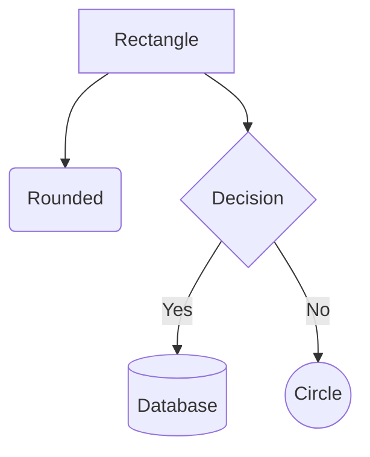
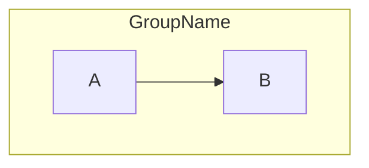
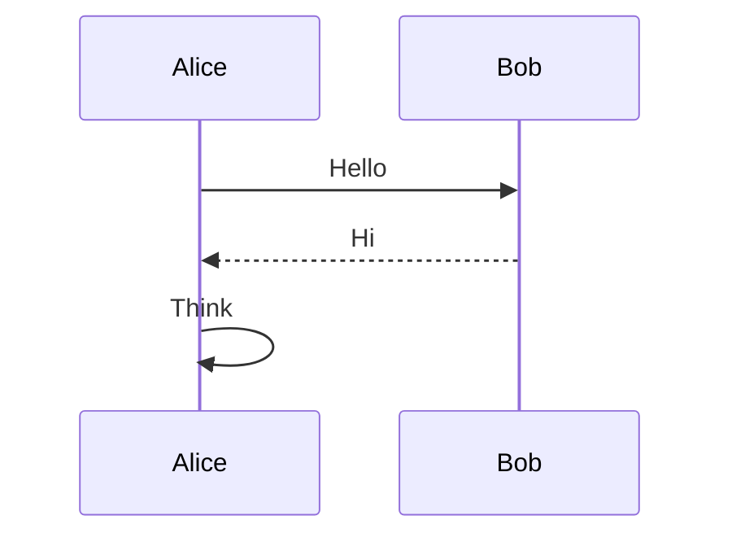
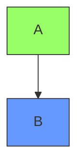

# Mermaid Diagram Skill

Create diagrams for blog posts: understand the content, pick the right diagram type, iterate with `mermaid-ascii` for terminal preview, then render final SVG with `mmdc`. Optionally polish with Gemini image generation — either as a fallback when Mermaid can't produce a good layout, or as an enhancement step after Mermaid output to get a more polished look.

## Invocation

```
/mermaid-diagram [description, sketch, or reference image]
```

## Expected Input

The user will typically provide one or more of:

- **A blog post path** — read it to understand the concepts that need diagramming
- **A description** — what the diagram should convey
- **A reference image** — an existing diagram to recreate or adapt (the user places it in `drafts/img/`)
- **An ASCII sketch** — a rough layout to formalize

## Workflow

### 1. Understand the Content

If working in the context of a blog post, **read the post first**. Understand:

- What concept or process needs a visual explanation
- What entities/steps/relationships are involved
- What level of detail serves the reader (not everything needs to be in the diagram)

### 2. Choose Diagram Type

Pick the type that best fits the content:

| Type | Keyword | Best for |
|------|---------|----------|
| Flowchart | `flowchart TD` / `flowchart LR` | Processes, trees, data flow |
| Sequence | `sequenceDiagram` | Interactions between actors over time |
| Class | `classDiagram` | Object relationships, system structure |
| State | `stateDiagram-v2` | State machines, lifecycles |
| ER | `erDiagram` | Database schemas, entity relationships |
| Mindmap | `mindmap` | Hierarchical brainstorming |

Flowchart directions: `TD` (top-down), `LR` (left-right), `RL`, `BT`.

Present the choice to the user before proceeding.

### 3. Look Up Syntax (if needed)

For flowcharts and sequence diagrams, the Quick Syntax Reference below is sufficient. For less common diagram types, fetch the docs:

```
https://raw.githubusercontent.com/mermaid-js/mermaid/develop/packages/mermaid/src/docs/syntax/<type>.md
```

Where `<type>` is one of: `flowchart`, `sequenceDiagram`, `classDiagram`, `stateDiagram`, `entityRelationshipDiagram`, `mindmap`, `timeline`, `gantt`, `pie`, `quadrantChart`, `block`, `architecture`, `sankey`, `xyChart`.

### 4. Draft the `.mmd` File

Write the full source file (with labels, styling, `classDef`) to `static/mmdc/<diagram-name>.mmd`. This is the file `mmdc` will render.

### 5. Preview with mermaid-ascii

`mermaid-ascii` is for quick structural verification in the terminal. It **cannot** parse the full Mermaid syntax, so you need to feed it a simplified version of the diagram.

**Critical: use bare node IDs only.** The `[label]` bracket syntax, `classDef`, `:::class` references, `<br/>`, and subgraphs all break `mermaid-ascii` or produce garbage output. Strip all of these for the preview.

Write a simplified preview file or pipe a stripped version:

```bash
# Option 1: separate preview file
mermaid-ascii -f static/mmdc/<diagram-name>-preview.mmd

# Option 2: inline via stdin
echo 'flowchart TD
    Root --> H12
    Root --> H34
    H12 --> H1
    H12 --> H2' | mermaid-ascii -f -
```

Use bare IDs that are descriptive enough to verify structure (e.g., `Root`, `H12`, `LeafA` — not `A`, `B`, `C`).

Iterate until the ASCII tree looks correct, then delete the preview file.

**mermaid-ascii limitations:**

- **No `[label]` syntax** — causes nodes to duplicate or layout to flatten
- **No `classDef` / `:::class`** — parsed as nodes, breaks everything
- **No subgraphs** — ignored or breaks layout
- **No special node shapes** — only rectangles
- **No `<br/>`** — use single-line labels
- **No `--ascii` flag** — despite what older docs say, current version doesn't have it

**Useful flags:**

- `-f -` — read from stdin
- `-x 8` — increase horizontal spacing
- `-y 8` — increase vertical spacing
- `-p 3` — increase box padding
- `--coords` — show grid coordinates (useful for debugging layout issues)
- `-v` — verbose output (shows parsed graph structure)

### 6. Render and Visually Verify

Render to PNG first (not SVG) so you can **read the image file and visually confirm** the output looks correct:

```bash
# Render PNG for visual verification
mmdc -i static/mmdc/<diagram-name>.mmd -o drafts/img/<diagram-name>.png -b white -s 2

# Read the PNG to visually confirm (use the Read tool on the .png file)
```

Once verified, render the final SVG and promote:

```bash
# Render final SVG
mmdc -i static/mmdc/<diagram-name>.mmd -o drafts/img/<diagram-name>.svg -b white

# After user approval, copy to final location
cp drafts/img/<diagram-name>.svg static/img/<diagram-name>.svg
```

### 7. (Optional) Polish with Gemini Image Generation

If the Mermaid output looks structurally correct but the user wants a more polished or custom-styled result, use `gemini-image.py` to generate a refined version. Feed it the rendered PNG as context along with a description:

```bash
.claude/skills/mermaid-diagram/gemini-image.py drafts/img/<name>-polished.png "Description of the diagram, based on the Mermaid version at drafts/img/<name>.png"
```

Use `-m pro` for higher quality (Nano Banana Pro), default is `-m flash` (free tier):

```bash
.claude/skills/mermaid-diagram/gemini-image.py -m pro drafts/img/<name>.png "Description..."
```

After user approval, copy to `static/img/`.

### 8. Embed in Post

```markdown
.svg" alt="Description of diagram">
```

## Alternative: Manual ASCII + Gemini Image Generation

If Mermaid can't produce a usable layout at all (e.g., complex spatial arrangements, precise positioning needed), skip Mermaid entirely:

1. **Draft the diagram manually as ASCII art** using Unicode box-drawing characters (`┌─┐│└─┘` for boxes, `─│` for lines, `►▼◄▲` for arrows). Keep labels concise. Align carefully.

2. **Generate a polished image** using `gemini-image.py`. Include the ASCII art in the prompt for spatial guidance:

```bash
.claude/skills/mermaid-diagram/gemini-image.py drafts/img/<name>.png "Description of the diagram to generate"
```

After user approval, copy to `static/img/`.

3. The user may also choose to use the ASCII art directly in the post (inside a code block), or feed it to an external image generator themselves.

## Tools

### mermaid-ascii

Terminal preview of Mermaid diagrams as ASCII art. Supports flowcharts and sequence diagrams.

- **Repo:** https://github.com/AlexanderGrooff/mermaid-ascii
- **Installed at:** `~/.local/bin/mermaid-ascii`
- **Update script:** `~/.local/bin/update-mermaid-ascii`

### gemini-image.py

Python script that generates images from text prompts via the Gemini API. Uses `uv run --script` for dependency management — no install needed.

- **Location:** `.claude/skills/mermaid-diagram/gemini-image.py`
- **Requires:** `GEMINI_API_KEY` environment variable
- **Models:** `flash` (default, free tier) or `pro` (higher quality, supports 2K resolution)

**Usage:**

```bash
gemini-image.py [options] <output-path> <prompt>

Options:
  -m, --model {flash,pro}    Model to use (default: flash)
  -i, --image <path>         Input image as reference (can be repeated)
  -s, --size {1K,2K}         Output resolution (default: 1K, 2K requires pro model)
  -a, --aspect-ratio <ratio> Aspect ratio (e.g., 16:9, 3:2, 1:1)
```

**Examples:**

```bash
# Basic generation
gemini-image.py drafts/img/diagram.png "A flowchart showing..."

# With reference image (e.g., Mermaid render)
gemini-image.py -i drafts/img/mermaid-render.png drafts/img/polished.png "Transform this into Excalidraw style..."

# High resolution with pro model
gemini-image.py -m pro -s 2K -i input.png output.png "Regenerate at higher resolution..."
```

### gemini-prompt-template.md

Prompt template for Gemini image generation. Contains:
- Standard prompt structure
- Color palettes (default, warm, cool)
- Example prompts
- Tips for effective generation

**Location:** `.claude/skills/mermaid-diagram/gemini-prompt-template.md`

Use this template as a starting point, especially for the Excalidraw hand-drawn style. Key principle: **keep diagrams clean, put explanations in the blog post text** — avoid annotations cluttering the image.

### beautiful-mermaid (not installed)

Node/TypeScript library for rendering Mermaid as SVG or ASCII with theming. Supports more diagram types than mermaid-ascii (flowcharts, sequence, state, class, ER). Could replace `mmdc` for SVG rendering.

- **Repo:** https://github.com/lukilabs/beautiful-mermaid
- **Install:** `npm install beautiful-mermaid`

## Quick Syntax Reference

### Flowchart Basics



**Node shapes:** `[rect]`, `(rounded)`, `{diamond}`, `[(database)]`, `((circle))`, `[[subroutine]]`, `>flag]`

**Edges:** `-->` solid arrow, `-.->` dotted, `==>` thick, `---` no arrow, `-->|label|` with label

**Subgraphs:**



### Sequence Diagram Basics



**Arrows:** `->>` solid, `-->>` dotted, `-x` cross, `-)` open

### Styling (for mmdc output only)



## Conventions

- Source `.mmd` files go in `static/mmdc/`
- Final SVGs/images for the blog go in `static/img/`
- Use white background (`-b white`) for blog theme compatibility
- See `static/mmdc/` for existing examples of style and frontmatter usage
- **Drafts and previews** go in `drafts/img/` (symlinked to the main worktree's `drafts/` — gitignored, local only)
  - The user may place reference images or hand sketches here as input
  - All intermediate/preview output goes here before promoting to `static/img/`
